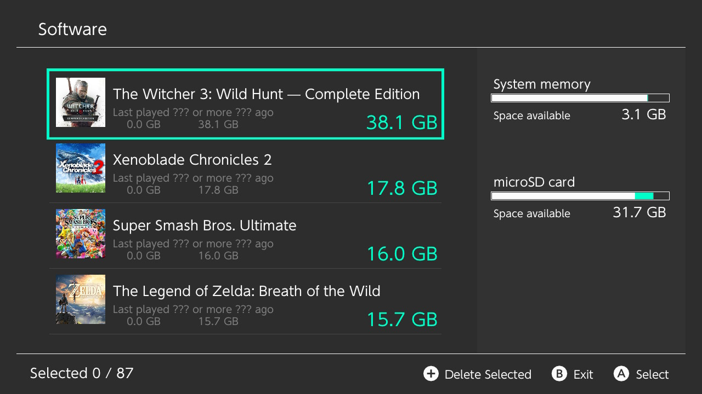
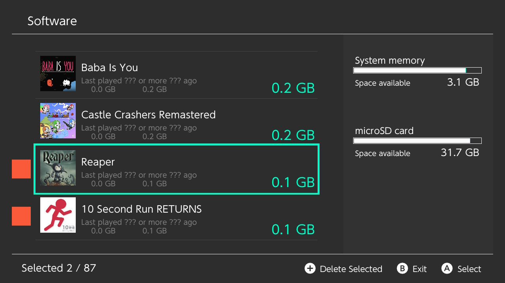
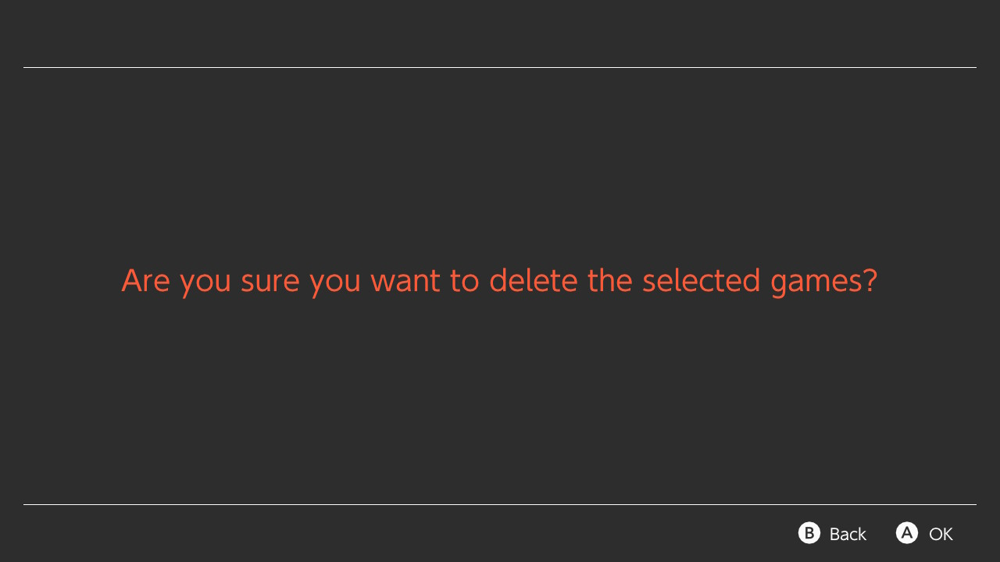

# untitled

Batch title uninstaller for the Nintendo Switch

---

## Credits

Special thank you to everyone that contributed to the following libs.

- [nanovg](https://github.com/memononen/nanovg)

- [libnx](https://github.com/switchbrew/libnx)

- [deko3d by fincs](https://github.com/devkitPro/deko3d)

- [deko3d backend for nanovg by adubbz](https://github.com/Adubbz/nanovg-deko3d)

And thank you to following people that helped me out

- shchmue for RE'ing `nsCalculateApplicationOccupiedSize` struct for me!

- werwolv for helping me out with templates ^^

- TeJay for helping test the app and providing the screenshots
